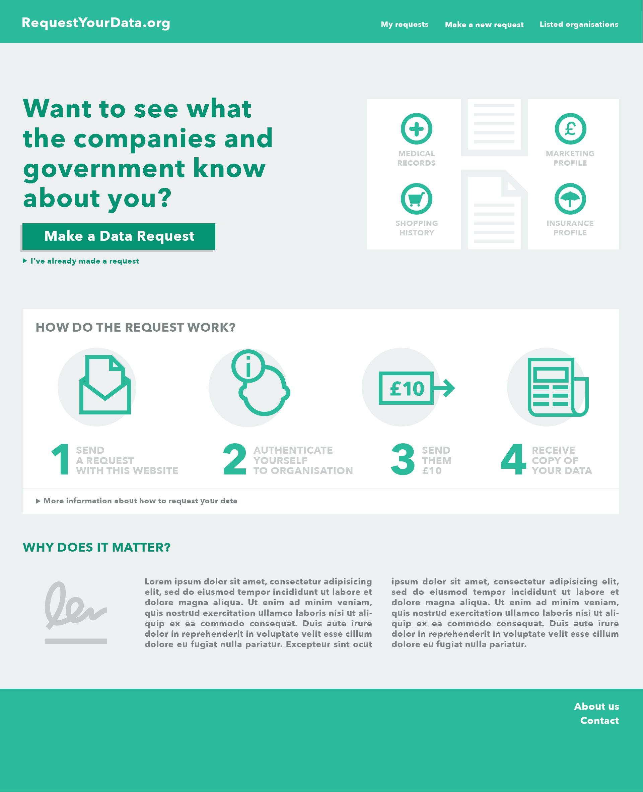
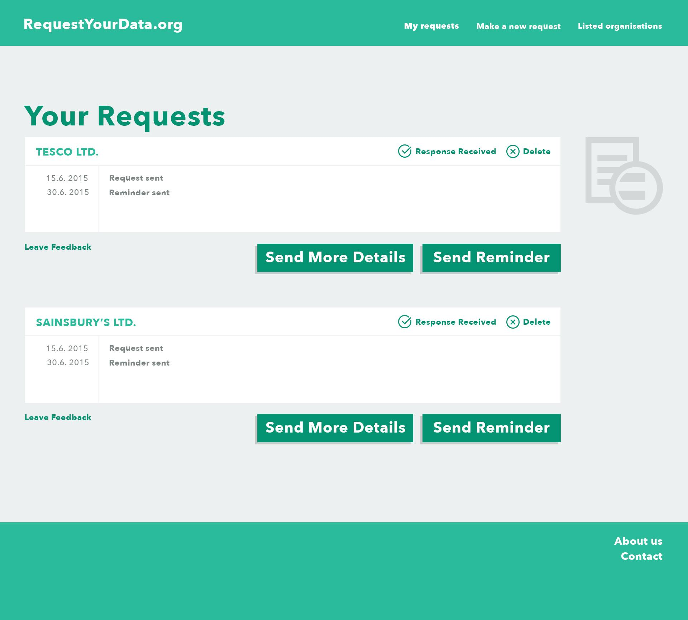

# Project Proposal

CSE-C2610 Project Proposal - Project proposal - **RequestYourData.org**

DRAFT version - still being edited.

## 1. Introduction

**RequestYourData.org** **is** **a website that makes it simple for citizens to get a copy of their personal data from companies and the government**. The project aims to create a system that can be** used in several European countries**.

Citizens of the European Union have legal right to request a copy of data about them from any organisation. Few people exercise this right over their data because the process of making personal data request is complicated. One has to know how to craft the right kind of message, find the contact details, manage correspondence, and do this without knowledge of previous experiences in dealing with particular organisations. Obviously, this is a problem that has technological solutions.

The proposed project will help people to access and use their own data such as their history purchases and loyalty card data; medical records; earnings history from tax authorities; or insurance and credit profiles. RequestYourData.org will contribute towards a new ecosystem of personal data management, often referred to as "MyData", that promises improved privacy and transparency as well as novel data-based services.

For the Finnish context the site will be run by Open Knowledge Finland ry. The project group has also participants in the United Kingdom and France that will run local versions of the project. Germany already has a proprietary data request system, [selbstauskunft.net](http://selbstauskunft.net), that has processed nearly a million cases.

## 2. Project goals

The product is fairly simple. The challenge is to build it well, so that it is easy for other providers to run an instance and to change it according to the needs of other national contexts. In simple terms, we need the functionality listed below. We have also attached a number of design sketches in the end of this document that illustrate what the website could look like.

* Users can can browse a pre-existing database of organisations, and leave feedback about them after attempting to make requests.

* Users can enter personal information to receive appropriate messages for requesting personal data, based on templates. These can be sent by email and other appropriate mediums.

* After the user has made a request, they can use the website to send organisations more information or a reminder message. The site will also send users an email to prompt them to complete their requests.

## 3. Tools and technology

We encourage the people working on the project to choose their own tools. We would love it if you use Git for version control and Django or Ruby on Rails for the back-end. These are the frameworks that people connected to the project are most familiar with.

## 4. Requirements for the students

We need skilled developers that can create the system with sufficient modularity and adaptibility for use in several countries, as well as system administration knowledge to make installation and e-mail services run smoothly. Design and user testing skills will be an advantage so that using the service becomes comprehensible and attractive to a range of users. Finnish language skills are useful for building the front-end for Finland.

## 5. Legal Issues

The results are published under open source license (MIT License)

## 6. Client

RequestYourData.org is being developed by a group of people based in Finland, the UK and France. The students joining the project would work most closely with people in Finland, who are associated with Open Knowledge Finland. The team on the client’s side has the following expertise:

.

Anssi Mikola: **_XXX_**

Antti Poikola: Project coordination, legal & MyData knowledge

Aleksi Knuutila: Back-end development and project management

Marion Blatter: User experience

Maxime Cordier: Data protection law

The client’s team is ready to commit four hours weekly for scrum meetings and other necessary support to guide development. We can also offer working space at the OKFFI office and a cloud server.

## 7. Other

### Contact information

Open Knowledge Finland is a registered not-for-profit association and part of the wider international Open Knowledge -network. We promote opening and usage of open knowledge and advance development of open society in Finland. The association was founded in 2012 and has more than 300 members who present widely the Finnish ‘open’ -scene including individuals, companies and other organizations. OKFFI is also a wide network of people and projects related to open knowledge. You don’t have to be member of the association in order to participate in the activities of the network.

Name: Anssi Mikola

Organization: Open Knowledge Finland

Role: Product Owner

E-mail: anssi.mikola@gmail.com

Telephone: +358 400 453612

Address: Caloniuksenkatu 9D,

Name: Aleksi Knuutila

Organization: Outlandish

Role: UK representative, back-end specialist

E-mail: aleksi.knuutila@iki.fi

Telephone: +44 7563089587

### Design sketches

For illustration, the following images are simple sketches of a potential design of the website. We hope that the final design and user experience of the system will be determined by the student group, and finalised through user testing. These images are included in the project proposal to make it clear to the reader the types of functionality we hope to see in the website. The sketches are made for the British version of the website, which will inevitable differ from the Finnish site.

**Image 1. Sketch of user interface and visual feel of frontpage**

**Image 2. Sketch of user interface for selection of organisations**

**Image 3. Sketch of user interface for filling in personal information**

**Image 4. Sketch of user interface for sending the request**

**Image 5. Sketch of user interface for continued communication**
